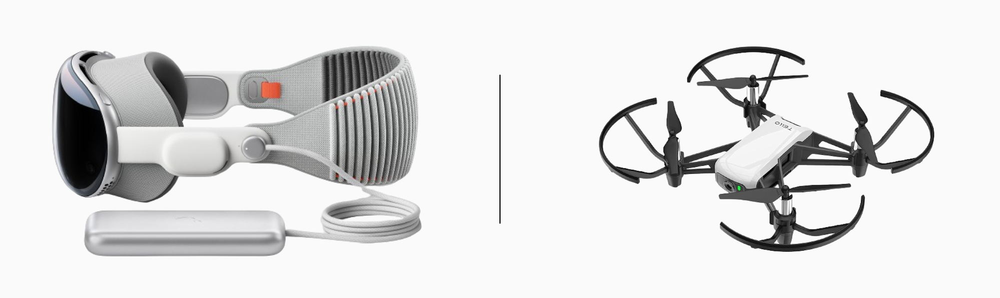
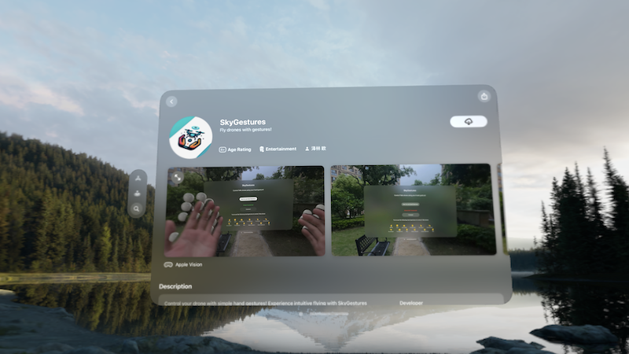

# SkyGestures

    

**SkyGestures** is an innovative app that uses hand gestures to control DJI Tello drones via the Vision Pro platform. Now open-sourced and available for free on the [Vision Pro App Store](https://apps.apple.com/us/app/skygestures/id6499123392). 

    

### Supported Gestures

The app supports 12 intuitive hand gestures to seamlessly control the DJI Tello drone:

| Action            | Gesture  |
|-------------------|----------|
| Takeoff           | 👌        |
| Land              | ✊        |
| Fly Upward        | 👆        |
| Fly Downward      | 🤏        |
| Fly Forward       | 🤙        |
| Fly Backward      | 🤚        |
| Fly Leftward      | 👈        |
| Fly Rightward     | 👍        |
| Stop              | 🫰        |
| Rotate Leftward   | 🤘        |
| Rotate Rightward  | 🤟        |
| Flip              | ✌️        |

## Requirements

- A DJI Tello drone device
- visionOS 1.0 or newer
- Xcode 15.2 or higher
- Swift 5.9 or above

## Usage

To get started with SkyGestures:

1. Power on the DJI Tello drone by pressing the button on the right side.
2. Connect your Vision Pro device to Tello's Wi-Fi network (e.g., **Tello-FD3293**).
3. Open SkyGestures app and tap **Start to Use Hand Gestures** to activate gesture detection.
4. Press **Connect** to establish a connection with the drone.
5. Enjoy controlling your Tello drone using intuitive hand gestures!

Watch this YouTube video for a detailed demonstration of the app:

## Future Features Roadmap

- **Integration of live video feed from Tello drone.** (**Investigating**) I may need help from the community to implement this feature!
- **Virtual 3D Tello drone model** for users without access to a physical drone. (**planned**)
- **Configuration panel** for customizing flight speed, monitoring battery levels, and more. (**planned**)
- **Formation flight control** for multiple Tello drones, allowing synchronized maneuvers and operations in a coordinated fleet.
- More features from your pull requests contributions!

## Contributing

We welcome contributions from the community! Whether you're looking to implement a new feature, fix bugs, or improve documentation, we appreciate your help.

## Contact

- Twitter: [zlinoliver](https://twitter.com/zlinoliver)
- Wechat: OliverOuYang
- GitHub: [zlinoliver](https://github.com/zlinoliver)
- Bilibili: [欧哥有料爆](https://b23.tv/pTpAMIs)

## Acknowledgements

We extend our sincere gratitude to the developers and contributors of the following open-source projects, which have played a pivotal role in the development of **SkyGestures**:

- **[HandVector](https://github.com/XanderXu/HandVector)** - The hand tracking feature is built upon the robust foundation provided by HandVector. Their pioneering work in gesture recognition has significantly enhanced our application's functionality.

Our project stands on the shoulders of these remarkable community contributions, and we are profoundly thankful for their efforts.

## License

SkyGestures is available under the MIT license. For more details, see the [LICENSE](./LICENSE) file.
